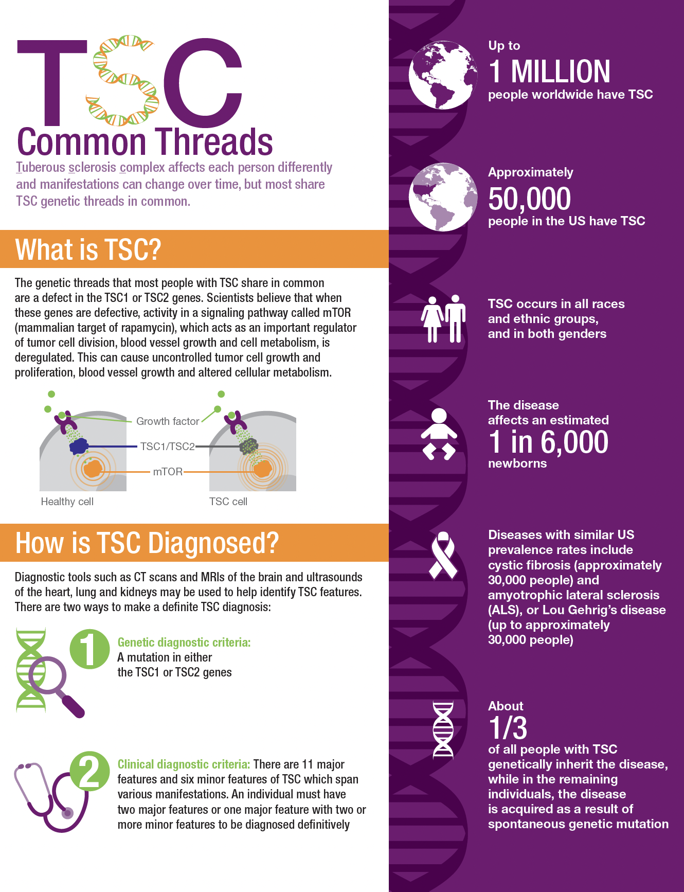

# TSC-snRNA

This project focuses on understanding **Tuberous Sclerosis Complex (TSC)** using **single-nucleus RNA sequencing (snRNA-seq)** data from human brain tissues. By profiling the transcriptomes at single-nucleus resolution, we aim to identify cell-type-specific gene expression patterns and dysregulated biological pathways associated with TSC.


  
*Source: [Novartis Infographic on TSC](https://www.novartis.com/news/media-library/tuberous-sclerosis-complex-common-threads-infographic)*


## Background

> **Tuberous Sclerosis Complex (TSC)** is a rare genetic disorder caused by mutations in either the **TSC1** or **TSC2** genes, leading to constitutive activation of the mTOR pathway. This results in abnormal cell growth and the formation of benign tumors in multiple organs, including the brain. TSC is often accompanied by neurological symptoms such as epilepsy, autism spectrum disorder, and intellectual disability.

Understanding how these genetic changes alter transcriptional programs at the cellular level is crucial to uncovering mechanisms of disease and potential therapeutic targets.


## Objectives

- Profile the transcriptomes of brain tissue from TSC and control samples at single-nucleus resolution.
- Identify distinct cell populations using clustering and marker-based annotation.
- Compare TSC vs. control within each cell cluster to uncover differentially expressed genes (DEGs).
- Perform functional enrichment analysis to highlight disrupted biological pathways in TSC.
- Visualize cell-type-specific expression and pathway differences across brain regions and patient groups.


## File Structure

```bash
.
├── README.md
├── images/
│   ├── TSC.png
│   └── tsc-common-threads-infographic.pdf
└── source/
    ├── 00_cellranger.sh                # Raw data processing using Cell Ranger
    ├── 01_data_loading_and_QC.R        # Load, QC, and doublet detection
    ├── 02_merge_data.R                 # Data normalization, integration, and UMAP
    ├── 03_integrate_analysis.R         # Clustering across resolutions and marker gene detection
    ├── 04_cell_type_annotation.R       # Cluster annotation using CellMarker DB
    ├── 05_cellCluster_DEG.R            # Cluster-level differential gene expression analysis
    └── 06_post_annotation.R            # Visualization, LPL gene analysis, and enrichment
```


## Analysis Workflow

### 1. Preprocessing with Cell Ranger (`00_cellranger.sh`)
- FASTQ files aligned to reference genome using Cell Ranger
- Outputs include filtered gene-barcode matrices (`.h5` files)

### 2. Quality Control and Filtering (`01_data_loading_and_QC.R`)
- Load filtered matrices into Seurat objects
- Annotate samples with metadata (PSZ-6, PSZ-7-tuber, etc.)
- Remove low-quality nuclei using thresholds on:
  - Number of genes/nucleus
  - Mitochondrial content
  - Doublet status (via `scDblFinder`)
- Save high-quality objects for downstream analysis

### 3. Data Integration and Visualization (`02_merge_data.R`)
- Normalize each sample, find variable genes, run PCA
- Integrate across samples using `FindIntegrationAnchors()` and `IntegrateData()`
- Perform dimensionality reduction (PCA + UMAP)

### 4. Clustering and Marker Gene Identification (`03_integrate_analysis.R`)
- Find clusters at multiple resolutions (0.1–1.0)
- For each resolution:
  - Identify cluster markers (`FindAllMarkers`)
  - Save UMAPs and cluster size statistics

### 5. Cell Type Annotation (`04_cell_type_annotation.R`)
- Annotate clusters based on match to CellMarker database (Human, normal brain)
- Compute expression and log2FC of marker genes for each cluster
- Output detailed annotation summary per cluster

### 6. Differential Expression Analysis (`05_cellCluster_DEG.R`)
- Compare all combinations of group pairs (e.g., PSZ-6 vs PSZ-7-tuber) per cluster
- Identify DEGs using Wilcoxon test, with thresholds on:
  - Adjusted p-value (`p_val_adj < 0.05`)
  - Absolute log2FC (> 0.25)
- Save DEGs to `.xlsx` and `.rds` files
- Perform GO enrichment using `gprofiler2` for both up- and down-regulated genes

### 7. Post-Annotation Analysis and Visualization (`06_post_annotation.R`)
- Plot UMAPs split by group and overall
- Generate barplots and violin plots for marker gene expression (e.g., **LPL** in microglia)
- Visualize DEG counts and enriched GO terms across clusters
- Save all figures to PDF for publication-ready output


## Key Tools and Libraries

- **R packages**: `Seurat`, `tidyverse`, `ggpubr`, `export`, `scDblFinder`, `gprofiler2`
- **Reference Databases**: CellMarker for human brain markers
- **External tools**: Cell Ranger (10x Genomics)


## Notes

- Clustering and annotation results are sensitive to resolution parameters; 0.1 was selected for primary figures.
- DEGs were filtered to highlight biologically meaningful fold changes (|log2FC| > 0.25).
- Enrichment results focus on **GO:BP** terms for interpretability in cellular functions.
